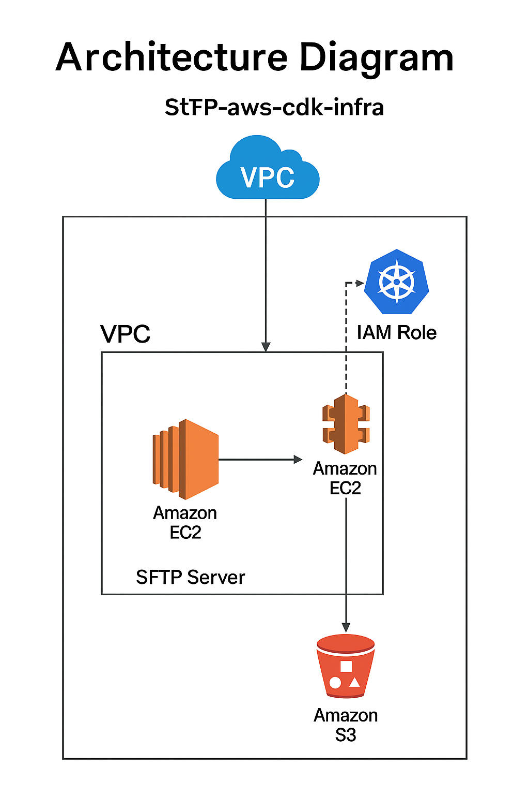

# Deploying a Secure SFTP-to-S3 Pipeline Using AWS CDK




Infrastructure as Code using AWS CDK to deploy an SFTP server on EC2 integrated with S3 — combining automation, security, and scalability in a DevOps-friendly stack.

## 🧱 What It Does

This project provisions the following resources using AWS CDK (in Python):

- A VPC with public/private subnets
- An S3 bucket for file storage
- An IAM Role with access to S3
- An EC2 instance to run the SFTP server (`SimpleSFTP`)
- All necessary networking and security group settings

The goal is to demonstrate AWS CDK in a practical portfolio use case, combining two existing components:

- [SimpleSFTP](https://github.com/daviguides/SimpleSFTP)
- [sftp2s3](https://github.com/daviguides/sftp2s3)

## 🚀 Getting Started

### Prerequisites

- Python 3.11+
- [`uv`](https://github.com/astral-sh/uv) for dependency management (or use `pip` if preferred)
- AWS CLI configured and credentials available

### Install dependencies

```bash
uv venv
source .venv/bin/activate
uv pip install -e .
```

### Bootstrap and Deploy

```bash
cdk bootstrap
cdk deploy
```

## 🧩 Structure

```
.
├── README.md
├── pyproject.toml
├── app.py
├── cdk.json
└── sftp_stack/
    ├── __init__.py
    └── sftp_stack.py
```

## 📄 License

MIT License

---

🔗 [Check out my full portfolio](https://daviguides.github.io/)

📂 [Explore more repositories on GitHub](https://github.com/daviguides)

📜 [Read the Zero Trust Manifesto for Local Development](https://daviguides.github.io/articles/devsecops/2025/04/25/zero-trust-manifest.html)
